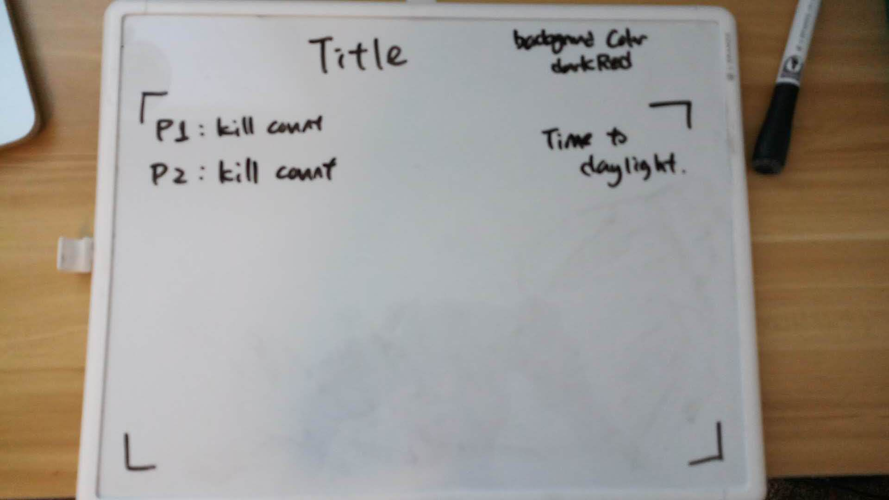
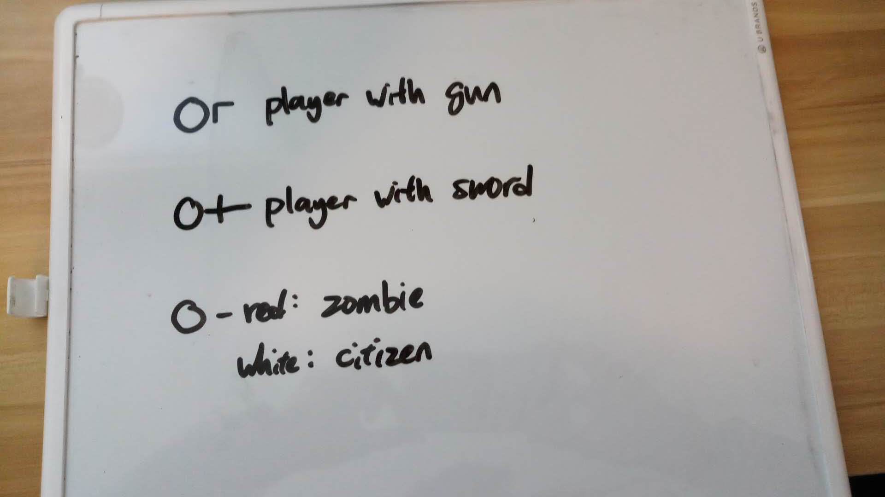
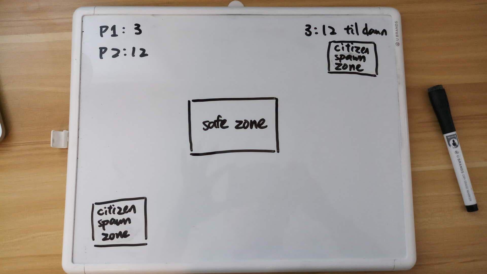
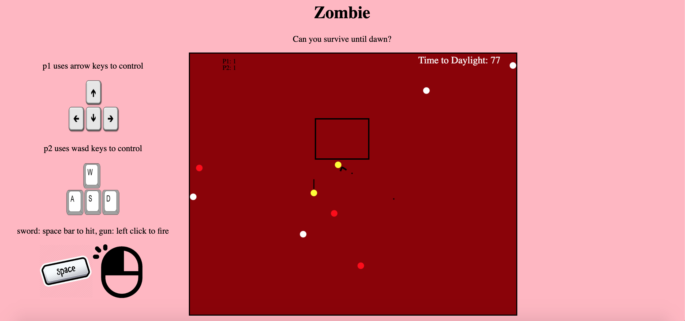

# Project-1

Proposal
========
gameplay:
---------
the goal of the player(s) is to survive until daylight in every stage, the player will have either a sword or a gun as a weapon to defeat the zombies. Game is over once the player got touched by a zombie. Zombies will spawn at random places except in the safe zone and will always walk toward the player or the citizens. The citizens will spawn randomly in the citizen spawn zone and walk in random direction. The citizens will change into zombies after being touched by zombie. Game ends when dawn arrives or both players are dead. 

user story:
-----------
User can select how many players after clicking the start button  
If selected 2 players, player 1 choose the first weapon and player 2 will have the other one. If single player, player can choose to weild a gun or a sword.  
Then user can select difficulty from easy, medium, and hard.  
player one will have **WASD** to control directions and movements  
player two will have **arrow keys** to control directons and movements  
whoever wields the gun will have the **mouse** to aim, **rightclick** to fire 1 bullet, and turn directions and whoever wields the sword can only turn with direction input and attack with **spacebar**  
**Safe zone** is the area where the zombies will not spawn.  
**citizen spawn zone** is the area where citiziens will spawn.  
It will take two bullets with the gun to kill a zombie. And it will only take one swing of the sword to kill a zombie.

wireframes:
-----------
webpage layout:

characters:

gameboard:

result:
----------
